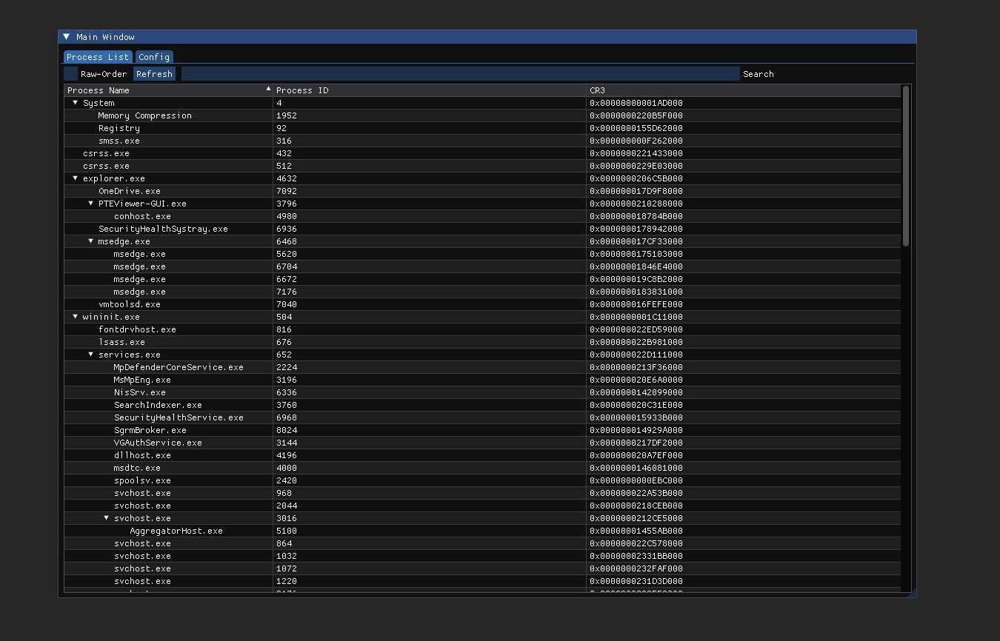
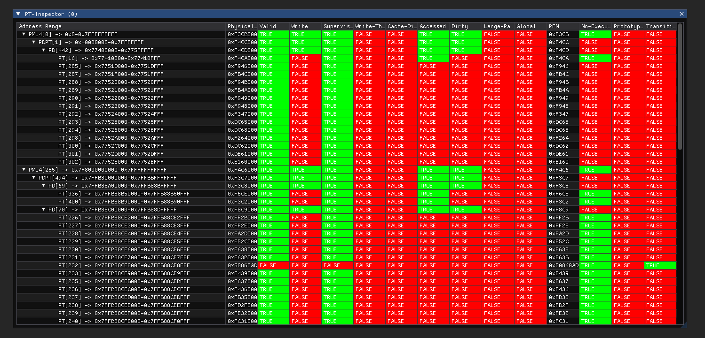

# PTEViewer
A lightweight tool for visualising paging tables on Windows 10/11 x64, featuring an intuitive ImGui interface.
<br><br>
This project is not finished, and there are lots of issues in the code. However, I feel people may find it useful so I am releasing it. This project will be maintained and updated with bug-fixes, new features and more architecture compatibility in the future.

### Features
1. **Process List:** Find and select a target process, with the ability to sort and search by name, PID and CR3.
2. **Paging Table Viewer:** Inspect PML4E, PDPTE, PDE and PTE entries, displaying hardware and software information such as physical address, write protection, supervisor bit, CoW bit, etc.
3. **Make Memory Resident:** Move memory pages into physical memory by right clicking on a paging entry.

### How To Use
**GUI Usage**
<br>
Search, sort, open and close processes in the process list.
Right click a process to view its paging tables.
<br><br>
**Loading Driver**
<br>
To use PTEViewer fully, you need to load it's driver and then run the GUI. To load the driver you will either have to enable test signing, disable DSE (Driver Signature Enforcement) or sign the driver yourself. I have left a test signed version in the compiled binaries.
<br><br>
Now you have a loadable version of the driver, you can load it easily with the SCM command-line. Run these commands in an administrator instance of CMD to load the driver.
<br><br>
To load the driver, you can do the following. (Replace FILEPATH with your file path.)
```
sc create pteviewer binPath=FILEPATH start=demand type=kernel
sc start pteviewer
```
To unload the driver, you can do the following.
```
sc stop pteviewer
sc delete pteviewer
```

### Screenshots

